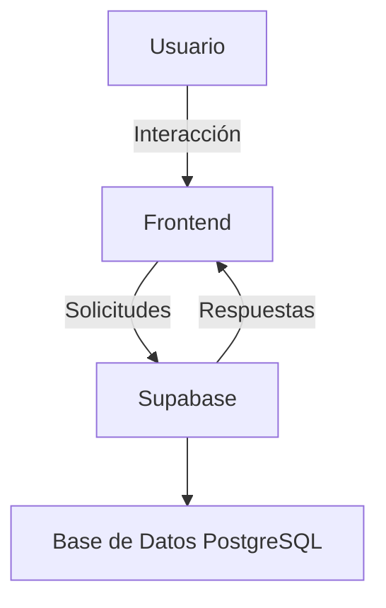
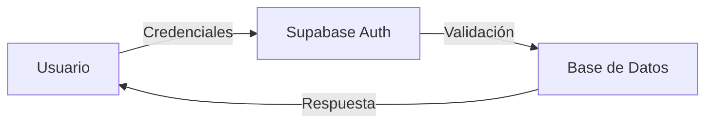

# HispanoTech-UGC-WEB

## Índice

1. [Descripción](#descripción)
2. [Estructura del Proyecto](#estructura-del-proyecto)
3. [Base de Datos](#base-de-datos)
4. [Hosting](#hosting)
5. [Diagramas](#diagramas)
6. [Instalación](#instalación)
7. [Uso](#uso)
8. [Contribución](#contribución)
9. [Licencia](#licencia)
10. [Documentación de Archivos y Carpetas](#documentación-de-archivos-y-carpetas)

## Descripción

HispanoTech es un proyecto de innovación tecnológica diseñado para asistir a las fuerzas de seguridad en la gestión de crisis mediante inteligencia artificial y robótica. Este sistema incluye herramientas avanzadas para la negociación policial y la gestión de situaciones críticas.

## Estructura del Proyecto

El proyecto está organizado de la siguiente manera:

- **HTML**: Contiene las páginas principales como `index.html`, `producto.html`, `login.html`, entre otras.
- **CSS**: Archivos de estilos organizados en base, componentes, layout y páginas específicas.
- **JS**: Scripts para funcionalidades como validaciones, lógica del mapa interactivo y llamadas al backend.
- **Models**: Modelos de datos para eventos, usuarios, roles, robots, entre otros.
- **Services**: Servicios para la interacción con Supabase (autenticación, administración, usuarios).
- **Config**: Configuración de la base de datos y cliente Supabase.
- **Assets**: Contiene imágenes, íconos, logos y otros recursos visuales.

## Base de Datos

El proyecto utiliza **Supabase** como base de datos. Supabase es una plataforma de código abierto que proporciona una base de datos PostgreSQL con funcionalidades avanzadas como autenticación, almacenamiento y APIs en tiempo real.

### Configuración

- El archivo `config/hispanodb.sql` contiene el esquema de la base de datos.
- El cliente de Supabase está configurado en `config/supabaseClient.js`.

## Hosting

El proyecto está alojado en **GitHub Pages**, lo que permite una fácil visualización y acceso al sitio web. Para acceder al proyecto, visita el siguiente enlace:

[HispanoTech en GitHub Pages](https://hispanotech-ugc.github.io/HispanoTech-UGC-WEB/)

## Diagramas

### Diagrama de Arquitectura



### Flujo de Autenticación



## Instalación

1. Clona este repositorio:
   ```bash
   git clone https://github.com/HispanoTech-UGC/HispanoTech-UGC-WEB.git
   ```
2. Instala las dependencias necesarias:
   ```bash
   npm install
   ```
3. Configura la base de datos en el archivo `config/hispanodb.sql` y ajusta el cliente en `config/supabaseClient.js`.

## Uso

1. Inicia el servidor local:
   ```bash
   npm start
   ```
2. Accede a la aplicación en tu navegador en `http://localhost:3000`.

## Contribución

1. Haz un fork del repositorio.
2. Crea una nueva rama para tu funcionalidad o corrección:
   ```bash
   git checkout -b feature/nueva-funcionalidad
   ```
3. Realiza tus cambios y haz un commit:
   ```bash
   git commit -m "Descripción de los cambios"
   ```
4. Envía tus cambios:
   ```bash
   git push origin feature/nueva-funcionalidad
   ```
5. Abre un Pull Request en este repositorio.

## Licencia

Este proyecto está bajo la licencia MIT. Consulta el archivo `LICENSE` para más detalles.

## Documentación de Archivos y Carpetas

### Archivos Principales

- **index.html**: Página principal del proyecto (Landing Page).
- **producto.html**: Página con detalles, funcionalidades y especificaciones del robot.
- **login.html**: Página de inicio de sesión para instituciones.
- **registro.html**: Página de registro restringido para administradores policiales.
- **operador.html**: Vista interna para los operadores.
- **conexion_bbdd.html**: Página para probar la conexión con la base de datos.
- **script.js**: Archivo principal de JavaScript para funcionalidades generales.

### Carpetas

- **assets/**: Contiene recursos visuales como imágenes, íconos y logos.
  - **imágenes/**: Incluye imágenes del robot, logos y otros elementos gráficos.
  - **iconos/**: Subcarpeta con íconos específicos para la interfaz.

- **config/**: Archivos de configuración.
  - **hispanodb.sql**: Esquema de la base de datos.
  - **supabaseClient.js**: Configuración del cliente de Supabase.

- **css/**: Archivos de estilos CSS.
  - **base.css**: Estilos generales y reset.
  - **componentes.css**: Estilos para componentes reutilizables.
  - **layout.css**: Estilos para la estructura de las páginas.
  - **páginas/**: Estilos específicos para cada página.

- **html/**: Contiene páginas HTML adicionales como `admin_cuerpos.html`.

- **js/**: Scripts de JavaScript.
  - **api.js**: Llamadas al backend o simulaciones de datos.
  - **auth.js**: Validaciones de login/registro.
  - **mapa.js**: Lógica del mapa interactivo.
  - **operador.js**: Funcionalidad para la vista del operador.

- **models/**: Modelos de datos.
  - **eventos.js**: Modelo para eventos.
  - **usuarios.js**: Modelo para usuarios.
  - **robot.js**: Modelo para robots.

- **services/**: Servicios para interactuar con Supabase.
  - **supa_admin.js**: Funciones administrativas.
  - **supa_auth.js**: Funciones de autenticación.
  - **supa_user.js**: Funciones relacionadas con usuarios.

- **my_first_rosweb/**: Contiene pruebas relacionadas con ROS (Robot Operating System).

- **prueba_camara/**: Archivos para pruebas de cámara.

- **web/**: Contiene una versión alternativa o pruebas del sitio web.
